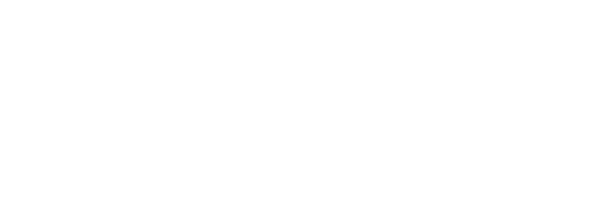

<!--
*** Thanks for checking out the Best-README-Template. If you have a suggestion
*** that would make this better, please fork the repo and create a pull request
*** or simply open an issue with the tag "enhancement".
*** Don't forget to give the project a star!
*** Thanks again! Now go create something AMAZING! :D
-->

<!-- PROJECT LOGO -->
 

  

<h3 align="center">Artisan Online Client</h3>

  

    Website for Artisan Residential Services. Built from scratch using ReactJS, Strapi, and Bootstrap.
     
    <a href="https://github.com/gunspartan/artisan-client"><strong>Explore the docs »</strong></a>
     
     
    <a href="https://artisan-online-client.herokuapp.com/">View Demo</a>
    ·
    <a href="https://github.com/gunspartan/artisan-client/issues">Report Bug</a>
    ·
    <a href="https://github.com/gunspartan/artisan-client/issues">Request Feature</a>
  

<!-- TABLE OF CONTENTS -->

  
Table of Contents

  <ol>
    <li>
      <a href="#about-the-project">About The Project</a>
      <ul>
        <li><a href="#built-with">Built With</a></li>
      </ul>
    </li>
    <li><a href="#license">License</a></li>
    <li><a href="#contact">Contact</a></li>
  </ol>

<!-- ABOUT THE PROJECT -->

## About The Project

[![Product Name Screen Shot][product-screenshot]](https://example.com)

A website I built as a freelancing gig for a local kitchen renovation company.

(<a href="#top">back to top</a>)

### Built With

- [React.js](https://reactjs.org/)
- [Strapi](https://strapi.io)
- [Bootstrap](https://getbootstrap.com)

(<a href="#top">back to top</a>)

<!-- LICENSE -->

## License

Distributed under the MIT License. See `LICENSE.txt` for more information.

(<a href="#top">back to top</a>)

<!-- CONTACT -->

## Contact

Gunn Hwang - gunhwang99@gmail.com

Project Link: [https://github.com/gunspartan/artisan-client](https://github.com/gunspartan/artisan-client) | [https://artisan-online-client.herokuapp.com](https://artisan-online-client.herokuapp.com)

(<a href="#top">back to top</a>)

[product-screenshot]: screenshot/screenshot.png
